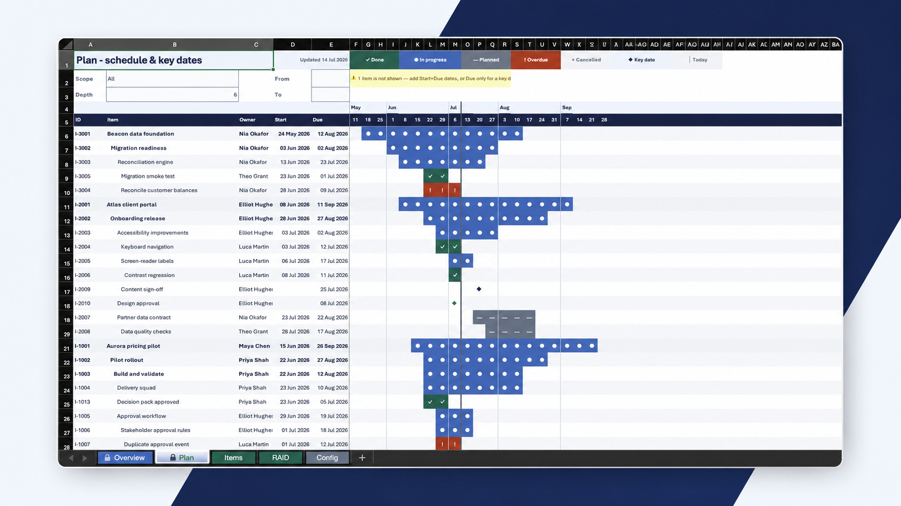
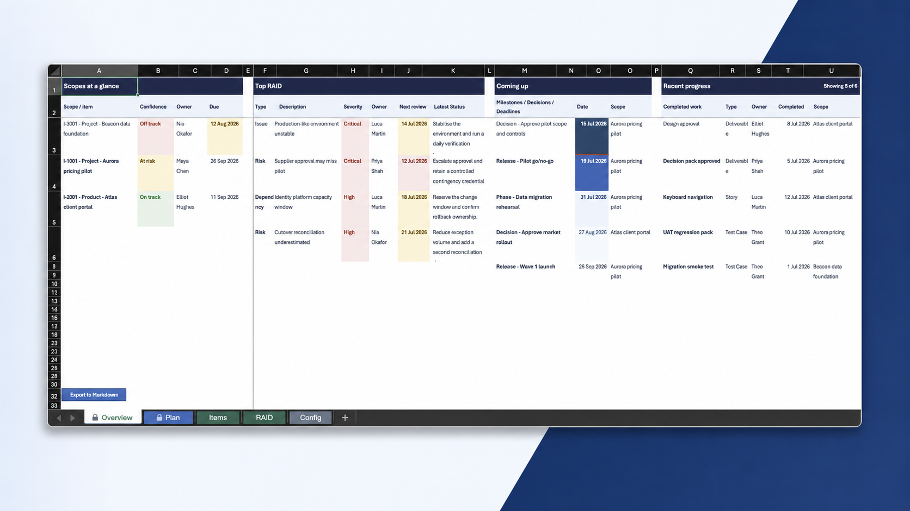
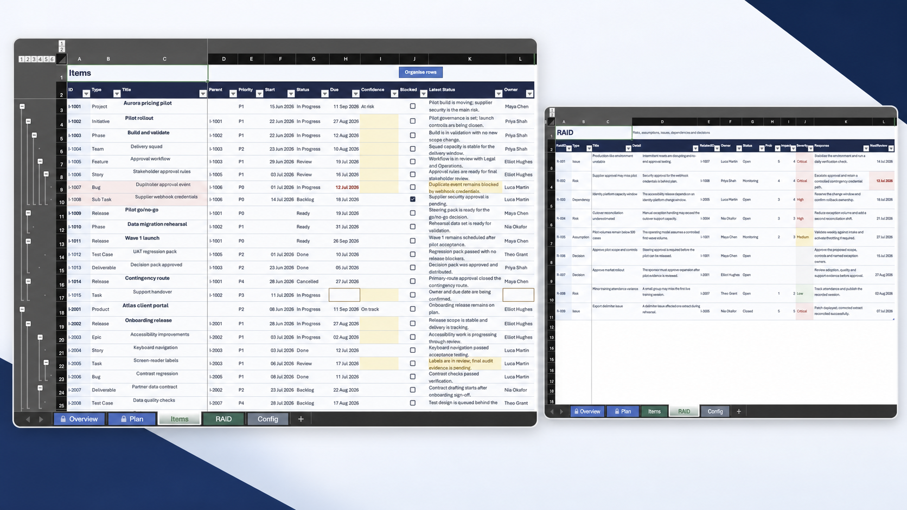

# Excel Project Management Workbook

This repository builds one lean, macro-enabled Excel 365 project tracker for when there is no single project, product or programme management tool that everyone involved can use. The generated release is [`PM_Workbook.xlsm`](PM_Workbook.xlsm).

That might be because the work spans teams, organisations, companies or regions, with each group using a different tool - or a different instance of the same one. `Overview` gives senior leaders one clean report without asking them to log into any of them. `Export to Markdown` gives you one status file to hand to any tool that cannot connect to those systems either.

Enter work in `Items`, record risks and decisions in `RAID`, and manage the workbook rules in `Config`. `Overview`, `Plan` and the protected `Calc` layer are derived from that source data.

## See it in action

The mock-ups use the populated demo workbook, so the hierarchy, dates and exceptions show how the finished system behaves.

<p align="center">
  <a href="docs/assets/readme/plan.png">
    
  </a>
</p>

<table>
  <tr>
    <td width="50%" valign="top">
      <a href="docs/assets/readme/overview.png">
        
      </a>
      <br><strong>Overview</strong> - a compact stakeholder readout built from live workbook data.
    </td>
    <td width="50%" valign="top">
      <a href="docs/assets/readme/items-raid.png">
        
      </a>
      <br><strong>Items & RAID</strong> - structured delivery data, hierarchy controls and clear exception highlighting.
    </td>
  </tr>
</table>

## What the workbook does

| Sheet | Purpose |
|---|---|
| Overview | Shows scopes, top RAID, upcoming dates and recent progress in four stakeholder panels |
| Plan | Shows a filterable six-level schedule with weekly bars, key dates and the current week |
| Items | Holds the editable hierarchy, workflow, ownership, dates, delivery health and latest status |
| RAID | Holds editable risks, assumptions, issues, dependencies and decisions |
| Config | Owns settings, taxonomy, workflow roles, severity bands and people |
| Calc | Supplies protected calculations, lookups and dynamic view data |

Its VBA assigns IDs, stamps workflow dates, organises the item hierarchy, fits the opening window to the screen and exports one clean UTF-8 Markdown file without runtime logs or sidecars.

## Build from source

The build needs Python 3.12 and the dependencies locked in `uv.lock`.

```bash
uv sync --frozen
.venv/bin/python -m build
```

The release pipeline requires the compiled VBA to match both source modules exactly. It builds untouched `.xlsx` and `.xlsm` baselines, full-rebuilds disposable copies in desktop Excel, and compares worksheet and table formulas, defined names, validation, conditional formatting, package parts and the VBA project before publication. Excel must have no other workbooks open because `CalculateFullRebuild` operates across the Excel application.

After either VBA source file changes, refresh the compiled project without opening the Visual Basic Editor:

```bash
.venv/bin/python -m build.automation.refresh_vba
```

The command replaces both complete modules in a disposable workbook, proves that no non-VBA package member changed, has desktop Excel compile and save the project, verifies the compiled caches and exact source, then atomically publishes `build/vba/vbaProject.bin`.

All destinations are published as one rollback-capable transaction:

- `dist/PM_Workbook.xlsx` - formula-only QA copy
- `dist/PM_Workbook.xlsm` - macro-enabled release
- `PM_Workbook.xlsm` - promoted release copy

Desktop Excel must be installed and the release command must be permitted to control it. Do not maintain the generated workbook by editing it directly. Change the source in `build/`, rebuild it and verify the result.

## Keep data across rebuilds

A rebuild produces an empty workbook, so structural changes never touch a populated copy directly. The data layer treats the workbook as a disposable rendering of two durable inputs: the source in `build/` and a JSON snapshot of everything a user authored - `Items` and `RAID` rows, `Config` lists, people and settings. Formula columns are never exported or injected; the rebuilt structure recomputes them.

```bash
.venv/bin/python -m build.data export [workbook]
.venv/bin/python -m build.data migrate [workbook]
```

`export` captures the authored data into `dist/snapshots/` (a bounded ring, newest twenty kept) and both commands default to the root `PM_Workbook.xlsm`. `migrate` exports a snapshot first, rebuilds the workbook from the current source with the same rows injected during the build, then reuses the release pipeline's desktop-Excel recalculation, semantic comparison and rollback-capable publication. The replaced workbook is kept in `dist/backups/` before anything is swapped.

Migration reconciles rather than guesses: rows keep their identifiers and source identities, new columns start blank and are reported, the VBA ID counters are raised above every existing identifier, and shipped example rows (the ones marked "EXAMPLE — delete this row") are skipped and counted. Anything that would lose data - out-of-schema columns, settings or tables, duplicate or missing identifiers, rows beyond the supported capacity, item types the taxonomy cannot level - halts before the build with an actionable message. Values the workbook itself flags in red, such as a status outside the configured list, migrate unchanged and are listed as warnings. Excel must have the workbook closed; the same snapshot format is the interchange for importing content from external systems.

### Update from any source through an agent

```bash
.venv/bin/python -m build.data describe [workbook] [--output FILE]
.venv/bin/python -m build.data plan CHANGESET|- [workbook] [--output FILE]
.venv/bin/python -m build.data apply CHANGESET|- [workbook] --approve PLAN_TOKEN [--output FILE]
```

The provider-neutral bridge lets an agent interpret an API, MCP tool, file or pasted text without giving any source a privileged workbook path. `describe` returns the strict JSON contract, current Config choices, records and exact digests. `plan` stays read-only and returns creates, updates, explicit Deleted transitions, no-ops, field diffs, warnings and a token bound to the intended workbook state and local lifecycle date. `apply` reparses and replans the same change set, requires the reviewed token and workbook digest, then uses the existing snapshot, rebuild, desktop-Excel verification and rollback-capable publication pipeline.

Only `Items` and `RAID` input fields can be changed. Source identities are durable system fields; IDs, formulas, lifecycle stamps, Config and People remain workbook-owned. Source omission never means deletion, and no row is physically erased. A true no-op creates no snapshot, backup or build artifact. See the complete contract example and paste-ready agent prompt in the [agent data bridge guide](docs/agent-data-bridge.md).

## Verify a release

The release gate has two explicit phases. First, run every automated check and create a template bound to the exact source tree and release workbook:

```bash
.venv/bin/python -m build.qa.release prepare --evidence-template /tmp/pm-workbook-macro-evidence.json
```

`prepare` returns status 2 after the automated gates pass because a release is deliberately blocked at that point. Use a disposable copy of the exact generated `.xlsm` to complete the live checks in [VBA maintenance](docs/vba-maintenance.md), fill every template check with `PASS`, and record the generated Markdown evidence. Then run:

```bash
.venv/bin/python -m build.qa.release final --macro-evidence /tmp/pm-workbook-macro-evidence.json
```

`final` accepts evidence only for the current source digest and exact release workbook, requires it to be less than 24 hours old, verifies the UTF-8 Markdown and export-directory contents, and reruns the non-mutating release matrix. Only its zero exit status is a shippable result. The matrix includes strict Ruff checks, source hygiene, compiled VBA matching, structural and design QA for both formats, formula scenarios, desktop-Excel save preservation, interaction performance and the populated demonstration workbook.

## Repository map

```text
build/
  automation/   VBA refresh, Excel recalculation, repair detection and performance measurement
  core/         design tokens, formula encoding, layout and OOXML styling
  data/         snapshots, provider-neutral change sets, merge, apply and migration
  qa/           structural, design, scenario, VBA and live-Excel checks
  scenarios/    representative release-data builder
  spec/         workbook schema, capacities, formulas and fixtures
  vba/          authoritative VBA source and compiled project
  writers/      worksheet composers
  pipeline.py   verified build and rollback-safe publication pipeline
docs/
  research/     source-backed Excel and product-pattern research
  *.md          user, design, domain, implementation and maintenance guides
PM_Workbook.xlsm
```

## Documentation

- [User guide](docs/user-guide.md)
- [Architecture and domain model](docs/pm-domain-reference.md)
- [Design system](docs/design-system.md)
- [Excel implementation reference](docs/excel-reference.md)
- [VBA maintenance](docs/vba-maintenance.md)
- [Agent data bridge](docs/agent-data-bridge.md)
- [Tooling and release capabilities](docs/capabilities.md)
- [Research index](docs/research/excel-2026/README.md)
